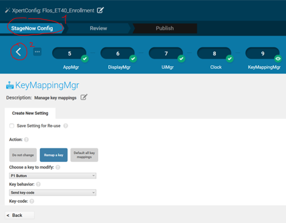
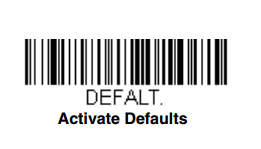
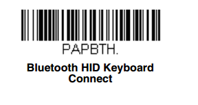

# StageNow Enrollment Guide for Zebra Devices

This guide walks you through installing and configuring **StageNow** for enrolling Zebra tablets (e.g., ET40 series) into your enterprise environment using a custom configuration profile.

---

## 🔗 Download StageNow

Download the latest version of StageNow from Zebra's official website:

👉 [Zebra StageNow Download Page](https://www.zebra.com/us/en/support-downloads/software/mobile-computer-software/stagenow.html?downloadId=85083242-9046-4c7e-8dd7-7cb2d23cd168)

---

## 📝 Requirements

- Java must be installed before using StageNow. You can download it here (to create the barcodes)
  👉 [Download Java from Zebra Support](https://www.java.com/en/download/)

---

## 🛠️ StageNow Installation Steps

1. **Launch the installer**  
   When prompted, enter the **administrator password**:  
   > This is required to access and edit configuration scripts.

2. **Select installation options**  
   - Tick the relevant checkboxes.

   - If Adobe Acrobat Reader is not installed, follow the wizard to install it. Otherwise, skip this step.

3. **Network Permission**  
   When the app runs, it will request permission to access the **local network**.  
   ⚠️ Make sure the computer hosting the StageNow app is **powered on** and connected to the **same local network** during enrollment.  
   If it's off or disconnected, device enrollment will fail.

---

## 📦 Importing Profiles

1. **Enter the admin password** again to unlock script options.
2. Download the profile XML file:  
   `Flos_ET40_Enrollment (StageNow)`
3. In StageNow, go to:  
   `All Profiles > Import Profiles`  
   Import the `.XML` file and wait patiently for it to load (the app is slow).

---

## ⚙️ Configuring the Profile

Navigate to `StageNow Config` and click the **"<"** icon to expand (see the picture below). Then edit the following steps:

1. **Wi-Fi Setup**  
   Modify the first Stage with your **enterprise Wi-Fi credentials**.  
   > ⚠️ This step must not be skipped or the script will fail.

2. **FileMgr (Stage 2)**  
   Replace the **Source File URI** with:  
    https://play.google.com/managed/downloadManagingApp?identifier=setup

3. **Intent (Stage 4)**  
Update the **JSON file path** with your own configuration file from **Microsoft Intune**.  
> If using a different enrollment token, ensure it points to the correct one.

4. **Disable Chrome (Stage 5)**  
This prevents Google account prompts and enforces the use of Microsoft Edge

5. **Display Settings (Stage 6)**  
This setting adjusts tablet settings (brightness, font size, etc.).  
> This setup only modifies **brightness**.

6. **UI Manager (Stage 7)**  
This setting enables **battery percentage** display.

7. **Clock Configuration (Stage 8)**  
This setting will:
  - Set the time to **military time**  
  - Add a **Windows NTP server** for time sync

8. **Disable Settings (Stage 9)**  
Disables the Settings button on the Zebra tablet by remapping it to do nothing. (User was able to bypass Kiosk Mode)

9. **Grant Overlay Permissions to NoKeyboard and Home Managed App if prompted (Stages 10 & 11)**  
   Two additional stages were added to automatically grant **overlay display permissions** to the NoKeyBoard app and Managed Home Screen

   - The **application package name** is already pre-configured.
   In **Stage 10**, select the `NOKEYBOARD.crt` certificate for the **application signature**.
   In **Stage 11**, select the `ENTERPRISE.crt` certificate for the **application signature**.

---

## ✅ Finalizing & Testing

1. Click **Review > Publish**
2. Select the `JS PDF417` stage client
3. Click **Test** to initiate enrollment and confirm that everything works as expected.

---

## 🔒 Post-Enrollment Setup

Once the device is enrolled successfully, follow these final steps:

### ✅ Grant Permissions to Managed Home Screen

1. Open the **Managed Home Screen** app.
2. Grant all requested permissions when prompted (e.g., usage access, overlay permissions, etc.).
3. Confirm that the app becomes the default launcher and locks the device to the intended user interface.

---

## 🧩 Resolving Keyboard Conflicts (NoKeyBoard App)

There is a known conflict between the **EWMS keyboard** and the default Android keyboard. To prevent overlapping input fields and improve the user experience in the EWMS app, follow these steps:

> **Note:** The initial setup steps for NoKeyBoard have been automated using StageNow. You only need to complete the following step manually.

1. Open the **NoKeyBoard** app.
2. Scroll down and tap **HIDE KEYBOARD** in the NoKeyBoard app.  
   - If prompted, grant **overlay display permission** to NoKeyBoard directly in the app.

Your device is now configured to avoid keyboard overlap issues when using EWMS.

---

## 🔗 Optional: Pairing an External Scanner

If you need to pair an external Bluetooth scanner:

1. Open the **Bluetooth Pairing Utility** (BPU) app on the Zebra device.
2. Grant permission for the app to enable Bluetooth.
3. Scan the following barcodes in order:
- `DEFALT` (to reset the scanner to factory settings)

  
- `PAPBTH` (to put the scanner in Bluetooth pairing mode)

  
4. Scan the barcode generated by the **Bluetooth Pairing Utility** app to complete the pairing process.

> After pairing, confirm the scanner is connected and functioning as expected.

---

### 🚪 Exiting Kiosk Mode

If you need to exit kiosk mode:

- Tap the **Back button 5 times**.
- The device will **prompt for a 4-digit password**, but you **won’t be able to type it because the NoKeyboard app won't let you**.
- Instead, you must **scan a barcode containing that 4-digit password**.
- This barcode can be created **in advance** [Here](https://barcode.tec-it.com/en/?data=Input%20the%20password%20here) (you can find this 4-digit password in the Intune settings).
> ⚠️ This step is **critical** for ensuring smooth operation of the custom **EWMS** application.

After exiting kiosk mode, you can reactivate the Android keyboard by switching back to your preferred input method in the keyboard settings. 

---

## 📋 Notes

- If enrollment fails, double-check Wi-Fi credentials and file paths.
- Always test profiles before large-scale deployment.
- If you get the error "the system cannot find the file specified StageNow" it's the JAVA
- 85% of success. 
---
